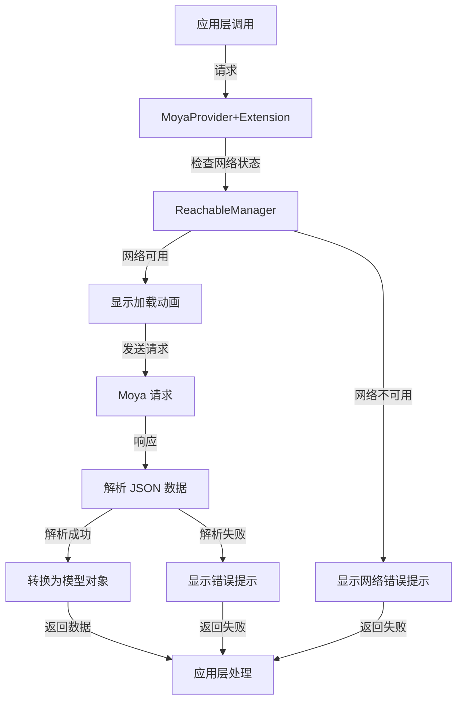
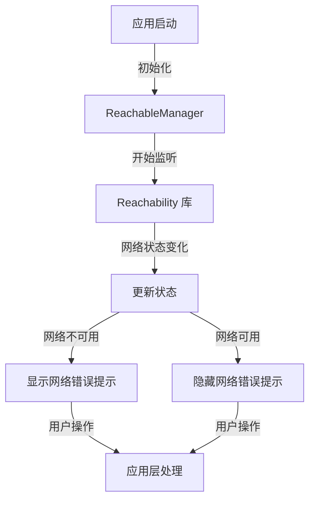

# XPBase 项目 Code Wiki

## 1. 项目概览

XPBase 是一个 iOS 开发基础库，提供了网络请求、网络状态管理、日志管理、UI 扩展等常用功能，旨在简化 iOS 应用开发过程中的重复工作，提高开发效率。

- **网络请求封装**：基于 Moya 实现的网络请求管理，支持统一的响应处理和错误处理
- **网络状态管理**：实时监测网络状态变化，提供网络不可用提示
- **日志管理**：支持不同级别的日志输出，兼容 iOS 9+ 系统
- **UI 扩展**：提供丰富的 UI 控件扩展方法，简化 UI 开发
- **数据模型**：提供基础数据模型结构，方便 API 响应数据解析

## 2. 目录结构

XPBase 采用模块化设计，将不同功能的代码组织到不同的目录中，便于维护和扩展。

```
XPBase/
├── Assets/            # 资源文件
├── Classes/           # 核心代码
│   ├── API/           # 网络相关功能
│   │   ├── LoadingView/     # 加载动画相关
│   │   ├── ReachableManager/ # 网络状态管理
│   │   ├── BaseModel.swift   # 基础数据模型
│   │   ├── MoyaProvider+Extension.swift # 网络请求扩展
│   │   └── RVCManager.swift  # 视图控制器管理
│   ├── Extensions/    # 各种扩展
│   │   ├── Codable+Ex.swift
│   │   ├── Date+Extension.swift
│   │   ├── Int+Extension.swift
│   │   ├── String+Extension.swift
│   │   ├── UIAlertController+Extention.swift
│   │   ├── UIButton+Extension.swift
│   │   ├── UIColor+Extention.swift
│   │   ├── UITableView+Ex.swift
│   │   ├── UITextField+Extension.swift
│   │   ├── UIView+Extension.swift
│   │   └── XPCompatible.swift
│   ├── Log/           # 日志管理
│   │   └── XPLogger.swift
│   └── Tool/          # 工具类
│       ├── MediaPickerTool/  # 媒体选择工具
│       └── rScreen.swift     # 屏幕相关工具
└── XPBase.podspec     # CocoaPods 配置文件
```

## 3. 系统架构与主流程

XPBase 采用分层架构设计，主要包含以下几层：

1. **基础层**：提供各种扩展和工具类，为上层功能提供支持
2. **网络层**：基于 Moya 封装的网络请求功能，处理 API 调用和响应
3. **UI 层**：提供 UI 控件的扩展方法，简化 UI 开发
4. **工具层**：提供各种工具类，如媒体选择、屏幕适配等

### 网络请求流程



### 网络状态监测流程



## 4. 核心功能模块

### 4.1 网络请求模块

网络请求模块基于 Moya 库进行封装，提供了统一的请求处理和响应解析功能。

#### 主要功能
- 统一的网络请求方法，支持泛型模型解析
- 网络状态检查，确保网络可用时才发送请求
- 加载动画显示与隐藏
- 统一的错误处理和提示
- 支持自定义响应成功码

#### 关键类与函数

| 类/函数名 | 说明 | 参数 | 返回值 | 所属文件 |
|----------|------|------|--------|----------|
| `MoyaProvider.request()` | 发起网络请求并解析响应 | target: Target, model: T.Type, showLoading: Bool, showMsg: Bool, responseSuccessCode: String, completion: ((T?) -> Void)? | Cancellable? | [MoyaProvider+Extension.swift](file:///Users/linxiaopeng/Documents/GitHub/XPBase/XPBase/Classes/API/MoyaProvider+Extension.swift) |
| `networkStatusJudgment()` | 检查网络状态 | 无 | Bool | [BaseModel.swift](file:///Users/linxiaopeng/Documents/GitHub/XPBase/XPBase/Classes/API/BaseModel.swift) |
| `showToastText()` | 显示提示信息 | text: String | 无 | [BaseModel.swift](file:///Users/linxiaopeng/Documents/GitHub/XPBase/XPBase/Classes/API/BaseModel.swift) |

### 4.2 网络状态管理

网络状态管理模块使用 Reachability 库监测网络状态变化，并在网络不可用时显示提示信息。

#### 主要功能
- 实时监测网络状态变化
- 网络不可用时显示顶部提示条
- 网络恢复时自动隐藏提示条
- 适配全面屏设备

#### 关键类与函数

| 类/函数名 | 说明 | 参数 | 返回值 | 所属文件 |
|----------|------|------|--------|----------|
| `ReachableManager` | 网络状态管理类 | 无 | 无 | [ReachableManager.swift](file:///Users/linxiaopeng/Documents/GitHub/XPBase/XPBase/Classes/API/ReachableManager/ReachableManager.swift) |
| `ReachableManager.shared` | 获取单例实例 | 无 | ReachableManager | [ReachableManager.swift](file:///Users/linxiaopeng/Documents/GitHub/XPBase/XPBase/Classes/API/ReachableManager/ReachableManager.swift) |
| `ReachableManager.checkNetworkState()` | 开始检查网络状态 | 无 | 无 | [ReachableManager.swift](file:///Users/linxiaopeng/Documents/GitHub/XPBase/XPBase/Classes/API/ReachableManager/ReachableManager.swift) |
| `ReachableManager.stateUseless` | 网络状态属性 | Bool | 无 | [ReachableManager.swift](file:///Users/linxiaopeng/Documents/GitHub/XPBase/XPBase/Classes/API/ReachableManager/ReachableManager.swift) |

### 4.3 数据模型

数据模型模块提供了基础的数据模型结构，方便 API 响应数据的解析和处理。

#### 主要功能
- 基础响应模型（BaseModel）
- 列表响应模型（BaseListModel）
- 简单代码消息模型（CodeMsgModel）

#### 关键类与函数

| 类/函数名 | 说明 | 参数 | 返回值 | 所属文件 |
|----------|------|------|--------|----------|
| `BaseModel<T>` | 基础响应模型 | 无 | 无 | [BaseModel.swift](file:///Users/linxiaopeng/Documents/GitHub/XPBase/XPBase/Classes/API/BaseModel.swift) |
| `BaseListModel<T>` | 列表响应模型 | 无 | 无 | [BaseModel.swift](file:///Users/linxiaopeng/Documents/GitHub/XPBase/XPBase/Classes/API/BaseModel.swift) |
| `CodeMsgModel` | 简单代码消息模型 | 无 | 无 | [BaseModel.swift](file:///Users/linxiaopeng/Documents/GitHub/XPBase/XPBase/Classes/API/BaseModel.swift) |

### 4.4 日志管理

日志管理模块提供了统一的日志输出功能，支持不同级别的日志和系统版本兼容。

#### 主要功能
- 支持不同级别的日志输出（debug、info、default、error、fault）
- 兼容 iOS 9+ 系统
- 提供结构化的日志格式
- 支持子系统和分类管理

#### 关键类与函数

| 类/函数名 | 说明 | 参数 | 返回值 | 所属文件 |
|----------|------|------|--------|----------|
| `XPLogger` | 日志管理类 | subsystem: String, category: String | 无 | [XPLogger.swift](file:///Users/linxiaopeng/Documents/GitHub/XPBase/XPBase/Classes/Log/XPLogger.swift) |
| `XPLogger.log()` | 输出日志 | message: String, level: LogLevel, file: String, function: String, line: Int | 无 | [XPLogger.swift](file:///Users/linxiaopeng/Documents/GitHub/XPBase/XPBase/Classes/Log/XPLogger.swift) |
| `LogLevel` | 日志级别枚举 | 无 | 无 | [XPLogger.swift](file:///Users/linxiaopeng/Documents/GitHub/XPBase/XPBase/Classes/Log/XPLogger.swift) |

### 4.5 UI 扩展

UI 扩展模块提供了各种 UI 控件的扩展方法，简化 UI 开发过程。

#### 主要功能
- UIView 扩展（加载 nib、添加圆角、设置 frame 等）
- UIColor 扩展
- UIButton 扩展
- UITextField 扩展
- 日期、字符串、整数等类型的扩展

#### 关键类与函数

| 类/函数名 | 说明 | 参数 | 返回值 | 所属文件 |
|----------|------|------|--------|----------|
| `UIView.xp.loadFromNib()` | 从 nib 加载视图 | nibname: String? | Self | [UIView+Extension.swift](file:///Users/linxiaopeng/Documents/GitHub/XPBase/XPBase/Classes/Extensions/UIView+Extension.swift) |
| `UIView.xp.addCorner()` | 添加圆角 | conrners: UIRectCorner, radius: CGFloat | 无 | [UIView+Extension.swift](file:///Users/linxiaopeng/Documents/GitHub/XPBase/XPBase/Classes/Extensions/UIView+Extension.swift) |
| `UIView.xp.removeSubView()` | 移除所有子视图 | 无 | 无 | [UIView+Extension.swift](file:///Users/linxiaopeng/Documents/GitHub/XPBase/XPBase/Classes/Extensions/UIView+Extension.swift) |
| `XPCompatible` | 兼容协议 | 无 | 无 | [XPCompatible.swift](file:///Users/linxiaopeng/Documents/GitHub/XPBase/XPBase/Classes/Extensions/XPCompatible.swift) |

## 5. 核心 API/类/函数

### 5.1 MoyaProvider+Extension

**功能**：扩展 MoyaProvider，提供统一的网络请求方法，支持泛型模型解析。

**关键方法**：
- `request<T>(_ target: Target, model: T.Type, showLoading: Bool = false, showMsg: Bool = true, responseSuccessCode: String = "1", completion: ((_ returnData: T?) -> Void)?) -> Cancellable?`
  - **参数**：
    - `target`：Moya TargetType 实例，定义请求的 URL、参数等
    - `model`：要解析的模型类型
    - `showLoading`：是否显示加载动画
    - `showMsg`：是否显示错误信息
    - `responseSuccessCode`：响应成功的代码
    - `completion`：请求完成后的回调
  - **返回值**：Cancellable 实例，可用于取消请求

**使用场景**：发起网络请求并解析响应数据为指定模型。

### 5.2 ReachableManager

**功能**：管理网络状态，监测网络连接变化并显示相应提示。

**关键属性**：
- `stateUseless`：网络是否不可用
- `shared`：单例实例

**关键方法**：
- `checkNetworkState()`：开始检查网络状态

**使用场景**：监测网络状态变化，在网络不可用时显示提示。

### 5.3 BaseModel

**功能**：基础响应模型，用于解析 API 响应数据。

**关键属性**：
- `code`：响应代码
- `errCode`：错误代码
- `time`：响应时间
- `msg`：响应消息
- `data`：响应数据

**使用场景**：作为 API 响应的基础模型，用于统一解析响应数据。

### 5.4 XPLogger

**功能**：统一的日志管理，支持不同级别的日志输出。

**关键方法**：
- `log(_ message: String, level: LogLevel = .default, file: String = #file, function: String = #function, line: Int = #line)`
  - **参数**：
    - `message`：日志消息
    - `level`：日志级别
    - `file`：文件路径
    - `function`：函数名
    - `line`：行号

**使用场景**：输出不同级别的日志，便于调试和问题定位。

### 5.5 UIView+Extension

**功能**：UIView 的扩展方法，提供各种便捷功能。

**关键方法**：
- `loadFromNib(_ nibname: String? = nil) -> Self`：从 nib 加载视图
- `addCorner(conrners: UIRectCorner, radius: CGFloat)`：添加圆角
- `removeSubView()`：移除所有子视图

**使用场景**：简化 UI 开发，提供便捷的视图操作方法。

## 6. 技术栈与依赖

| 技术/依赖 | 版本/说明 | 用途 | 来源 |
|----------|----------|------|------|
| Swift | 5.0+ | 开发语言 | [Apple](https://developer.apple.com/swift/) |
| Moya | 15.0+ | 网络请求库 | [GitHub](https://github.com/Moya/Moya) |
| HandyJSON | 5.0+ | JSON 解析库 | [GitHub](https://github.com/alibaba/HandyJSON) |
| Toast-Swift | 5.0+ | 提示信息库 | [GitHub](https://github.com/scalessec/Toast-Swift) |
| Reachability | 5.0+ | 网络状态监测库 | [GitHub](https://github.com/ashleymills/Reachability.swift) |
| SnapKit | 5.0+ | 自动布局库 | [GitHub](https://github.com/SnapKit/SnapKit) |

## 7. 关键模块与典型用例

### 7.1 网络请求模块

**功能说明**：发起网络请求并解析响应数据。

**配置与依赖**：
- 依赖 Moya、HandyJSON、Toast-Swift
- 需要在应用启动时初始化 ReachableManager

**使用示例**：

```swift
// 定义 API Target
enum APIService: TargetType {
    case getList
    
    var baseURL: URL {
        return URL(string: "https://api.example.com")!
    }
    
    var path: String {
        return "/list"
    }
    
    var method: Moya.Method {
        return .get
    }
    
    var task: Task {
        return .requestPlain
    }
    
    var headers: [String : String]? {
        return nil
    }
}

// 创建 Provider
let provider = MoyaProvider<APIService>()

// 发起请求
provider.request(.getList, model: BaseModel<[ItemModel]>.self, showLoading: true) { (data) in
    if let items = data?.data {
        // 处理数据
    }
}
```

### 7.2 网络状态管理

**功能说明**：监测网络状态变化并显示提示。

**配置与依赖**：
- 依赖 Reachability、SnapKit

**使用示例**：

```swift
// 在应用启动时初始化
func application(_ application: UIApplication, didFinishLaunchingWithOptions launchOptions: [UIApplication.LaunchOptionsKey: Any]?) -> Bool {
    // 开始监测网络状态
    ReachableManager.shared.checkNetworkState()
    return true
}

// 检查网络状态
if networkStatusJudgment() {
    // 网络可用，执行操作
} else {
    // 网络不可用，显示提示
}
```

### 7.3 日志管理

**功能说明**：输出不同级别的日志。

**配置与依赖**：
- 无特殊依赖

**使用示例**：

```swift
// 创建日志器
let logger = XPLogger(subsystem: "com.example.app", category: "Network")

// 输出不同级别的日志
logger.log("Request started", level: .info)
logger.log("Response received", level: .debug)
logger.log("Error occurred", level: .error)
```

### 7.4 UI 扩展

**功能说明**：提供 UI 控件的扩展方法。

**配置与依赖**：
- 无特殊依赖

**使用示例**：

```swift
// 从 nib 加载视图
let customView = UIView.xp.loadFromNib("CustomView")

// 添加圆角
button.xp.addCorner(conrners: [.topLeft, .topRight], radius: 8)

// 设置视图位置和大小
view.xp.x = 100
view.xp.y = 100
view.xp.width = 200
view.xp.height = 100
```

## 8. 配置、部署与开发

### 8.1 安装

XPBase 可以通过 CocoaPods 安装：

```ruby
pod 'XPBase', :git => 'https://github.com/travelcookies/XPBase.git'
```

### 8.2 初始化

在应用启动时，需要初始化网络状态监测：

```swift
func application(_ application: UIApplication, didFinishLaunchingWithOptions launchOptions: [UIApplication.LaunchOptionsKey: Any]?) -> Bool {
    // 开始监测网络状态
    ReachableManager.shared.checkNetworkState()
    return true
}
```

### 8.3 开发建议

1. **网络请求**：使用 MoyaProvider+Extension 的 request 方法发起网络请求，统一处理响应和错误
2. **网络状态**：在发起网络请求前检查网络状态，避免在网络不可用时发起请求
3. **日志管理**：使用 XPLogger 输出不同级别的日志，便于调试和问题定位
4. **UI 开发**：使用 UI 扩展方法简化 UI 开发，提高代码可读性

## 9. 监控与维护

### 9.1 网络状态监控

XPBase 提供了网络状态监测功能，可以实时监测网络状态变化并显示提示。在网络不可用时，会自动显示顶部提示条，网络恢复时自动隐藏。

### 9.2 日志监控

使用 XPLogger 输出的日志可以在 Xcode 控制台查看，便于调试和问题定位。在生产环境中，可以根据需要调整日志级别，避免过多的日志输出。

### 9.3 常见问题

| 问题 | 原因 | 解决方案 |
|------|------|----------|
| 网络请求失败 | 网络不可用 | 检查网络连接，确保设备已连接到网络 |
| 响应解析失败 | 服务器返回数据格式不正确 | 检查服务器返回的数据格式，确保与模型定义一致 |
| 加载动画不显示 | showLoading 参数设置为 false | 将 showLoading 参数设置为 true |
| 网络状态提示不显示 | 未初始化 ReachableManager | 在应用启动时调用 ReachableManager.shared.checkNetworkState() |

## 10. 总结与亮点回顾

XPBase 是一个功能丰富的 iOS 开发基础库，提供了网络请求、网络状态管理、日志管理、UI 扩展等常用功能，旨在简化 iOS 应用开发过程中的重复工作，提高开发效率。

### 主要亮点

1. **模块化设计**：采用模块化设计，将不同功能的代码组织到不同的目录中，便于维护和扩展。
2. **网络请求封装**：基于 Moya 实现的网络请求管理，支持统一的响应处理和错误处理，简化了网络请求的编写。
3. **网络状态管理**：实时监测网络状态变化，提供网络不可用提示，提升用户体验。
4. **日志管理**：支持不同级别的日志输出，兼容 iOS 9+ 系统，提供结构化的日志格式。
5. **UI 扩展**：提供丰富的 UI 控件扩展方法，简化 UI 开发，提高代码可读性。
6. **数据模型**：提供基础数据模型结构，方便 API 响应数据解析，减少重复代码。

XPBase 是一个轻量级的基础库，适合作为 iOS 应用开发的基础组件，帮助开发者快速构建高质量的 iOS 应用。